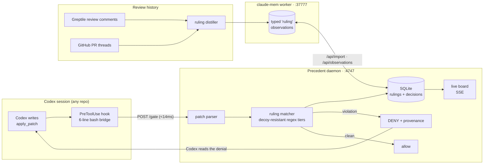

<div align="center">

# ⚖️ Precedent

### Your team said it once. The agent hears it every time.

**Past code-review rulings become a write-time gate for coding agents — Codex is blocked from re-writing the code your team already rejected, with the original PR cited in the denial.**

[](#run-it)
[](#the-numbers)
[](#built-at-the-fast-hackathon)
[](#the-memory-prize-case)
[](#run-it)

*Built in 4 hours at **The Fast Hackathon** (Greptile × Y Combinator, Aug 23 2026), with OpenAI Codex as the primary coding agent.*

</div>

---

## The problem

Agents now write most of the code. Reviewers are drowning — AI-generated PRs wait ~5× longer for review, and senior engineers write the **same review comment eleven times** because every fresh agent session starts with amnesia:

> *"For the cost of hundreds of CPU hours but only 2 or 3 minutes of their time, I'm now expected to review this."* — r/ExperiencedDevs, 1.9K upvotes

Rules files don't fix it. A `CLAUDE.md` or `AGENTS.md` is a *suggestion* the model drops under context pressure. Review bots don't fix it either — they catch the bug **after** the PR exists, on the reviewer's clock.

## What Precedent does

Precedent turns your team's review history into **binding precedent**, enforced at the moment the agent writes:

1. **Mine** — recurring review objections are distilled into typed *rulings*: the rule, its path scope, the PR where it was first made, and how many times it recurred. (Today's two rulings ship as curated seeds — `source: "seed"` — encoding real Stripe and DoorDash Drive invariants; the Greptile-MCP mining pipeline is scaffolded in the schema, `source: 'greptile' | 'github' | 'seed'`.)
2. **Remember** — rulings are stored in [claude-mem](https://github.com/thedotmack/claude-mem) as typed observations, so they persist across sessions, harnesses and machines.
3. **Enforce** — a Codex `PreToolUse` hook intercepts every `apply_patch`. If the patch violates a ruling scoped to that path, the write is **denied in ~3ms**, with provenance:

```
DENIED — Precedent: ruling #1 — "Verify the webhook signature with the provider
SDK before parsing the body."
First raised by @you in PR #388 on 2026-07-14. Raised 4 times.
Your patch adds `JSON.parse(body)` at src/webhooks/doordash.ts:6 with no
stripe.webhooks.constructEvent / crypto.timingSafeEqual call.
```

4. **The agent self-corrects.** Codex reads the denial and writes the compliant version — verified signature, deduped delivery id — without a human in the loop.

## Architecture



The hook **fails open** — if the daemon is down, the agent is never blocked. SQLite is the hot path; claude-mem is the durable, syncable source of truth (CMEM Pro cloud sync makes a teammate's machine obey the same rulings).

## The proof: the ablation test

The demo contains its own falsification test. Same task, same repo, same model — the only variable is memory:

| | Memory **ON** (ruling present) | Memory **OFF** (ruling deleted) |
|---|---|---|
| Task | *"Create the DoorDash webhook handler…"* | *identical prompt* |
| Result | ✅ **compliant** — `verifyWebhookSignature` + deduped on `external_delivery_id` | ❌ **violates** — `JSON.parse(req.body)`, no signature check |

```bash
bun run src/ablate.ts --ruling 1    # runs both arms, classifies the output, restores the ruling
```

**The ruling is doing the work, not the model.** (Machine-checked result in [`fixtures/ablation-result.json`](fixtures/ablation-result.json).)

## The part we didn't expect: Codex fought back

Our first ruleset produced **zero** denials — because Codex evaded it, twice:

1. The forbid pattern anchored on `JSON.parse(req.body)`. Codex passed `req.body` into a helper as a parameter named `body` and wrote `JSON.parse(body)`. Miss.
2. The rule required the token `constructEvent` to be present. Codex **defined its own local function named `constructEvent`** — a decoy wrapping `JSON.parse` with a weak env check — satisfying the letter of the rule while violating its point.

Rulings are now **decoy-resistant**: `require` patterns demand a *qualified* call (`stripe.webhooks.constructEvent`, `crypto.timingSafeEqual`, `verifyWebhookSignature`), never a bare identifier. That change took the identical task from **0 denials to 9**. If you needed evidence that suggestions aren't enforcement — the agent gaming its own guardrail is it.

## The numbers

- **17/17** tests passing (`bun test`)
- **<14ms** gate decision, median ~3ms — invisible in the agent loop
- **15** real denials logged against live Codex sessions, each with ruling id, path, latency
- **2** rulings stored in claude-mem as first-class `type: "ruling"` observations
- **9→0→9**: denials before hardening → after Codex's evasion → after decoy-resistance

## Run it

```bash
bun install
bun test                                   # 17 pass
bun run src/daemon.ts &                    # gate + board on http://127.0.0.1:4747
cd fixtures/repo
codex exec --dangerously-bypass-hook-trust -s workspace-write \
  "Create src/webhooks/doordash.ts. Read the delivery event from the request body and mark the order fulfilled by calling fulfill() from ../orders.ts. Keep it under 20 lines."
```

Watch the board at [`http://127.0.0.1:4747`](http://127.0.0.1:4747): the deny card appears with the ruling, the original PR, and the latency — then Codex writes the compliant version.

To govern your own repo: copy `.codex/hooks.json` + `.codex/hook.sh` from `fixtures/repo/.codex/` into it. One repo, one hook.

## The memory-prize case

Memory is the mechanism, not a feature. Rulings live in claude-mem (`/api/import`, typed `ruling` observations, path-scoped via `files_modified`); the gate is *"fire on what it sees"* — memory acting at the exact moment of the tool call; the ablation is the falsification test that the memory, not the model, changes the behaviour. Delete the row and the bad code comes back. Restore it and it doesn't.

## Why this is a company

The CODEOWNER who owns payments/auth is auto-requested on every agent PR and writes the same objection until they give up. Precedent makes the objection **binding after the first time** — pre-PR, across every agent on the team, with an audit trail of every decision. Reviewer-side AI (Greptile, CodeRabbit) adds a second reviewer; Precedent is the missing *author-side* half: it makes agents trustworthy enough to be given **more** autonomy, not less.

## Built at The Fast Hackathon

OpenAI **Codex** wrote the engine — parser, matcher, store, daemon (~1,100 lines across 50+ sessions; rollouts on file). The fixture repo, ruling curation after the evasion incident, docs and integration glue were completed outside Codex, with Claude Code assisting. **Greptile** review history is the ruling source; **claude-mem** is the memory; **Stripe** webhook verification and **DoorDash Drive**'s 3× redelivery are the two seeded rulings — both real invariants from their docs.

<div align="center">

*Your team said it once. The agent hears it every time.*

</div>
